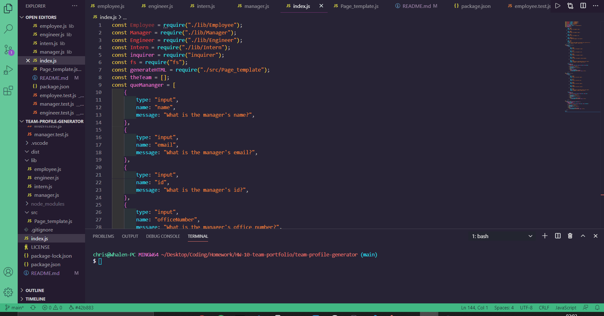

# Team-Profile-Generator

## Contributers
* Chris Whalen, Github: **[CobaltFrostfish](https://github.com/CobaltFrostfish)**

## Links
* **[Repository](https://github.com/CobaltFrostfish/team-profile-generator)**
# 

## The project
Do you need to build a profile for your team that holds information on how to contact them. Do you not have the time to sit and build set profile? Well hello profile generator! Just follow the prompts to add you team to the profile and then when you're done...Click, Boom, Pow...A team profile is born! So start it up and check it out! What are you waiting for?

## Technologies applied
* JavaScript
* NodeJS
* HTML
* BootStrap
* Jest

## The final production:

